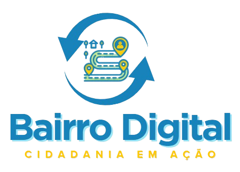

# Bairro Digital

Projeto desenvolvido para a disciplina Projeto Aplicado Multiplataforma - Etapa 2 da Universidade de Fortaleza (UNIFOR), baseado em Desenvolvimento de Sistemas Baseados em Microserviços. A proposta consiste em uma aplicação multiplataforma com frontend responsivo e backend em arquitetura de microserviços, voltada para atender comunidades locais (ONGs, entidades públicas, grupos sociais, etc.).

## 🌱 Objetivo de Desenvolvimento Sustentável (ODS)
Este projeto contribui com os ODS ao promover inclusão digital e acesso à informação para comunidades locais.

---

## 📁 Estrutura do Projeto
```
BairroDigital/
├── css/                # Estilos CSS (Bootstrap e personalizados)
├── img/                # Imagens do site
├── login.html          # Tela de login
├── pagInicial.html     # Página inicial da aplicação
├── perfil.html         # Tela de perfil do usuário
├── detalhes.html       # Página de detalhes do recurso/usuário
├── js/                 # Scripts JS (futuramente para API calls)
└── backend/            # Backend com microserviços Back4App
```

---

## 🚀 Como Rodar o Projeto

### ✅ Pré-requisitos
- Navegador moderno (Chrome, Firefox, Edge)
- Node.js e npm (para backend futuro)

### ▶️ Frontend (atual)

1. Clone o repositório:
```bash
git clone https://github.com/pliniogoncalves/BairroDigital.git
```

2. Acesse o diretório:
```bash
cd BairroDigital
```

3. Abra o arquivo `login.html` diretamente no navegador.


### ▶️ Testes com Postman
Assim que as rotas da API forem criadas, será adicionado um arquivo `.postman_collection.json` com os testes de todas as rotas disponíveis.

---

## 🧪 Tecnologias Utilizadas

### Frontend
- HTML5
- CSS3 + Bootstrap
- JavaScript (puro)

### Backend (planejado)
- Node.js
- Express ou Fastify
- JWT para autenticação
- PostgreSQL ou MongoDB (via ORM/ODM)
- Docker (opcional)

---

## 🔧 Funcionalidades Futuras
- Login e autenticação de usuários
- Cadastro de informações da comunidade
- Exibição de dados dinâmicos via API
- Integração com banco de dados relacional

---


---

## ☁️ Hospedagem
- Frontend: [Vercel](https://vercel.com/)

---

## 📸 Captura de Tela


---

## 📄 Licença
Este projeto está licenciado sob a Licença MIT. Veja o arquivo [LICENSE](LICENSE) para mais detalhes.

---

## 📣 Apresentação à Comunidade
- Será realizada via Google Meet.
- Formulário de coleta de feedback será disponibilizado junto à apresentação.

---

## 📬 Contato
Para dúvidas ou contribuições, abra uma issue no GitHub ou envie um e-mail para a equipe.
